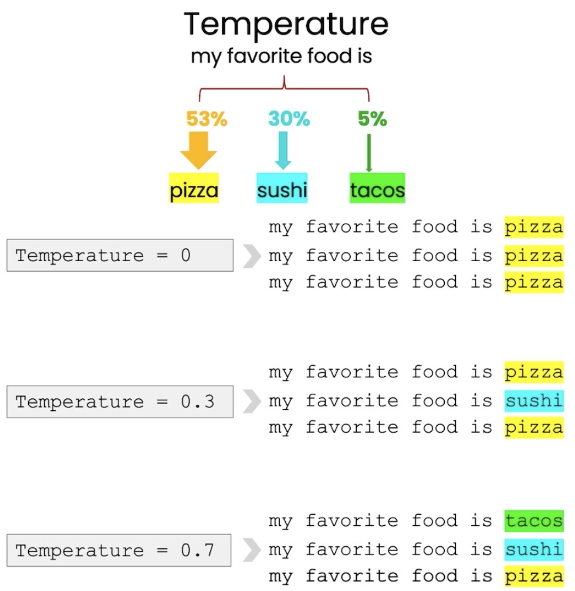
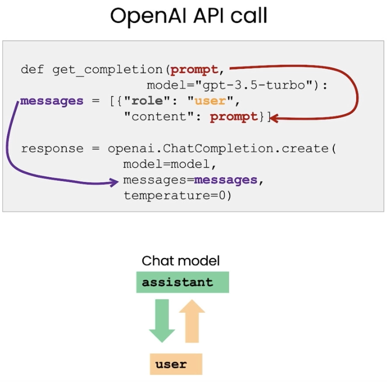
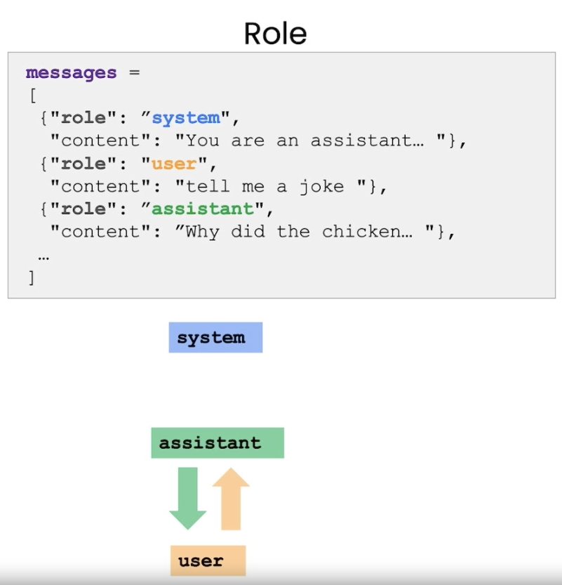

# ChatGPT Prompt Engineering for Developers
Materials for the [ChatGPT Prompt Engineering for Developers](https://www.deeplearning.ai/short-courses/chatgpt-prompt-engineering-for-developers/) course.

For educational purposes. Use responsibly.

# Temperature Explained

Temeprature changes the variaty of the generated text. The higher the temperature, the more random the generated text will be (less likely words). The lower the temperature, the more similar the generated text will be to the training data.

If you are trying to build the system that is predictable and reliable you should go with `0`.

For creative ways use higher temperature.

# Chat Flow

The system message gives the instruction (sets behavior of assistant).

